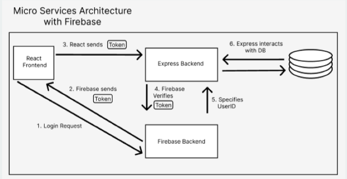
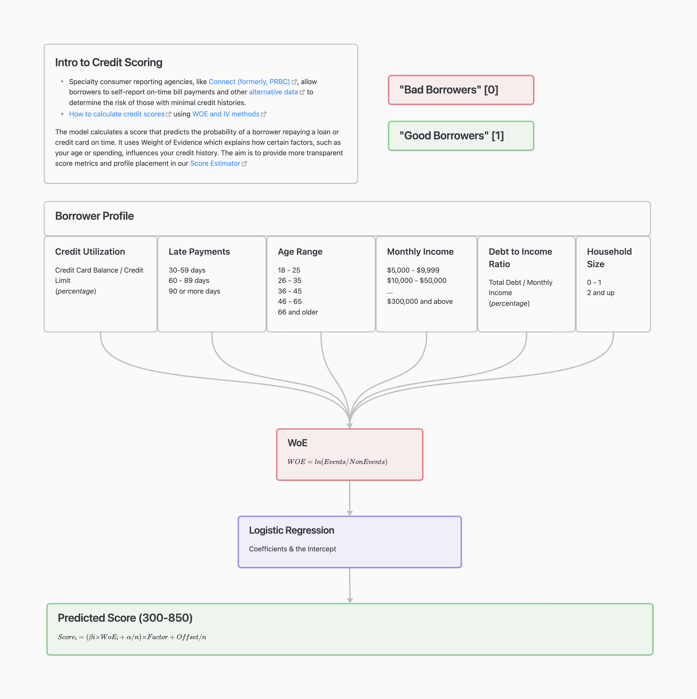

# 💸 Financial Literacy Hackathon 2023
*General Assembly Hackathon Summer August 14th 2023*

***Result: 1st Place***


## Hackathon Prompt

Create a more complete, data-driven, real-time credit score software that considers a borrower's finanacial and credit history from the beginning of time and can be used to qualify borrowers for credit and loans. Nice to have features can include: consider bill payments, rent, utilities, subscriptions, and visualization of data.


## Description

Embark on a seamless credit journey with our innovative web application. ScoreEase introduces a user-friendly interface that seamlessly combines the power of real-time data analysis with the entirety of your financial history. Say farewell to complex credit assessments and embrace a new era of simplicity and accuracy, as ScoreEase effortlessly allows borrowers to view credit and loans by tapping into their complete financial narrative, all at your fingertips.

## Github Repository Links
- Frontend Repo: https://github.com/Jagerziel/Credit_Score_App_Frontend
- Backend Repo: https://github.com/krsnamara/Credit_Score_App_Backend
- Data Modeling Repo: https://github.com/codewithkate/Credit_Score_App_Model


## Backend Endpoints

- Home: http://localhost:4000/
- Data: http://localhost:4000/test


## Data Schema (Image Output Coming Soon)
**Test Screen**

The information gathered from the front end stores the user's data as they enter it on ScoreEase  The model is constructed as follows:

```
const InfoSchema = new Schema(
  {
    Age: { type: String },
    NumberOfDependents: { type: String },
    MonthlyIncome: { type: String },
    MonthlyExpenses: { type: String },
    Accounts: { type: String },
    RevolvingUtilization: { type: String },
    RealEstateLoans: { type: String },
    ThirtyFiftyNinePastDue: { type: String },
    SixtyEightyNinePastDue: { type: String },
    NinetyDaysLate: { type: String },
    Score: { type: String },
    uid: String,
  },
  {
    timestamps: true,
  }
);
```

Given the time constraints (3 days) for this project, a minimal structure was included however in the future this could be built out to better protect the information flowing to the database.

## How ScoreEase was Built

### Design

The initial question we had to answer is how we wanted to approach this application.  Our team is comprised of `1 UX/UI Designedr`, `3 Software Engineers`, and `2 Data Scientists`.  After a day of planning, our approach became the following:

 - Data Science Team: Plan and research the best approach to determining how the score would be calculated.  
 - Software Engineering Team:  Set up the base shell code for the Front-End and Back-End, testing all routes, setting up base react components, discussing all dependencies, and aligning on naming conventions
 - UX/UI Team: Research similar applications currently available on the market and begin wireframing

We also agreed, given the 3-day timeframe, to limit the design to an iPhone 14-max with plans to provide more responsive design in the future.  Given the limited time, the Software Engineering team determined it would be best to ensure full CRUD, user authentication, and dynamic rendering was prioritized first.

### Colloaboration

A critical piece to our team success was the team collaboration.  All teams discussed the appropriate input and output fields.  This ensured that the interface designed by UX/UI would take the necessary inputs required by the Software Engineering and Team Data Science teams.  The method of calculation was much discussed as well and ultimately determined that the Data Science Team would provide a `Scorecard` to be implemented for dynamic rendering on the web application.  

### The Backend

The framework was constructed using Express, MongoDB, and Firebase.  Collaborating with the data science team, the model was built to intake the fields required to store the variables necessary to compute a user's credit score.  The Schema, as illustrated above, includes one additional field for `uid` or `user id`.  This field maps with Firebase ensuring a user is logged in before any access or changes to their data can be made.

### Full Stack Data Flow with Firebase

The below diagram illustrates the communciation flow between the Front-End, Back-End, and Firebase.  



### Data Science Modelling Approach

The model calculates a score that predicts the probability of a borrower repaying a loan on time.  It uses Weight of Evidence (WoE) which explains howcertain factors, such as age or spending, affects credit history.  The aim is to provide more transparent scoring metrics.



### The Result

Our team collaborated across many fronts to construct a full stack MERN applciation with user authentication leveraging data modeling, intuitive UX design, and seemless usability.  

`***This application was awarded first place in General Assembly's Summer Hackathon!***`


<!-- ## Deployed Website

on its way..


--- -->

## Technologies Used

### Back-End Dependencies

- cors
- dotenv
- express
- firebase-admin
- mongoose
- morgan
- nodemon

### 💻 Full Stack Technologies Used

[](https://skillicons.dev)

- HTML5
- CSS3
- JavaScript
- React
- Express
- Python
- MongoDB
- Figma
- Git/Github
- Nodejs
- Vercel

## Future Features

- More robust schema
- More efficient API call methods
- Packaging for integration into other business products

## Team

**Alaysia Veal (Software Engineer)**
[LinkedIn](https://www.linkedin.com/in/alaysia-veal/) |
[GitHub](https://github.com/AlaysiaVeal)

**Kimberly Mannette (UX/UI Designer)**
[LinkedIn](https://www.linkedin.com/in/kimberlymannette/) |
[GitHub](https://github.com/kimberlymannette)

**Kate Crawford (Data Science Engineer)**
[LinkedIn](https://www.linkedin.com/in/kaitlencrawford/) |
[GitHub](https://github.com/codewithkate)

**Mark Harris (Data Science Engineer)**
[LinkedIn](https://www.linkedin.com/in/markcharris1/) |
[GitHub](https://github.com/MarkCHarris)

**Martin Fitzpatrick (Software Engineer)**
[LinkedIn](https://www.linkedin.com/in/martinj-fitzpatrick/) |
[GitHub](https://github.com/krsnamara)

**Ryan Ehrlich (Software Engineer)** 
[LinkedIn](https://www.linkedin.com/in/ryanehrlich/) |
[GitHub](https://github.com/Jagerziel)

